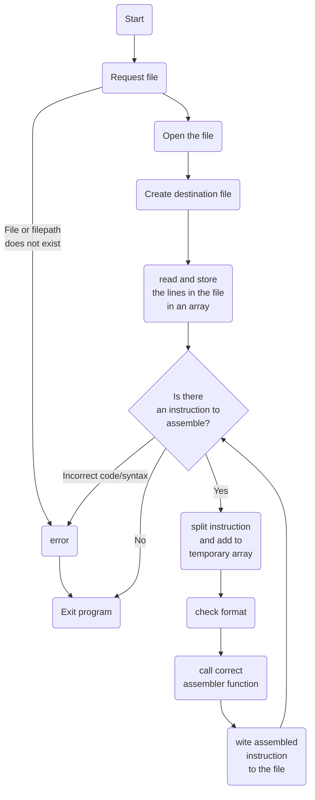

# 32-bit RISC-V ISA Assembler

A simple assembler

```mermaid

graph TB

    start(Start)
    file(Request file)
    error(error)
    exit(Exit program)
    openFile(Open the file)
    readLines(read and store
    the lines in the file
    in an array)
    newFile(Create destination file)


        analyzeFile{Is there 
        an instruction to 
        assemble?}
        split(split instruction
        and add to
        temporary array)
        format(check format)
        function(call correct 
        assembler function)
        assembledFile(wite assembled
        instruction 
        to the file)

    start --> file

    file -- File or filepath 
    does not exist --> error 

    file --> openFile
    error --> exit
    openFile --> newFile
    newFile --> readLines
    readLines --> analyzeFile
    analyzeFile -- Yes --> split
    analyzeFile -- No --> exit
    analyzeFile -- Incorrect code/syntax --> error
    split --> format
    format --> function
    function --> assembledFile
    assembledFile --> analyzeFile
```