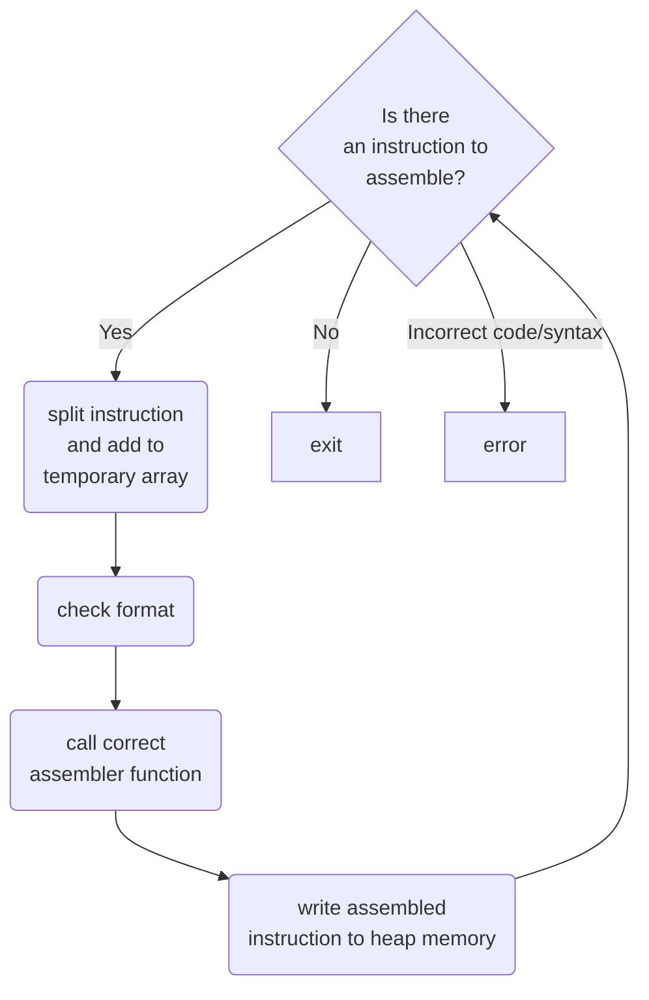

# 32-bit RISC-V Assembler 


* Gui created with RayGui
* Does not support labels
* Only supports uppercase instructions
* Does not support psuedo instructions
* Does not support register aliases

## To-do List

* Remove case sensitivity
* Add support for register aliases 
* Add support for RV32M
* Add support for psuedo instructions
* Add support for label decoding


## Program Data Flow




## How to use

* Create a .txt a file and fill it with instructions in the style as shown below

```MIPS
example code:

ADD x4, x6, x8
SW x4, 24, x28
ADDI x5, x5, 345
```
*remember that this program does not support labels yet, and you will have to calculate the offsets yourself at the time being*


