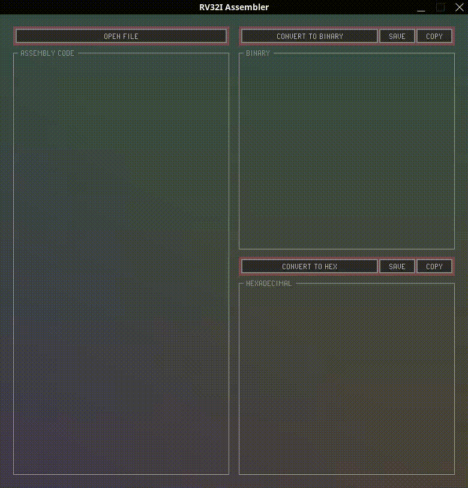
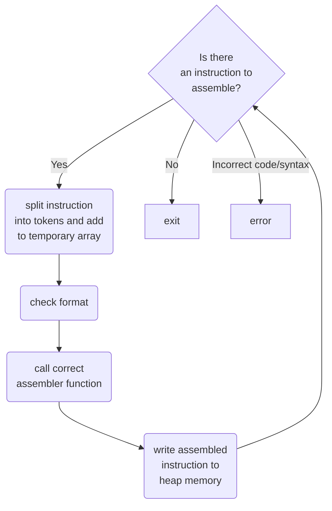

<p align="center">
    
</p>

<h1 align="center">Risc-Verter 32</h1>

<p align="center">
  A lightweight and minimalistic 32-bit RISC-V instruction converter for educational purposes
</p>


> **Features**
* Gui created with the [**Raygui**](https://github.com/raysan5/raygui/tree/master) library
* Has support for all RV32I Instructions
* Can convert up to 4096 instructions at once
* Can either copy or save the converted data
* Comments can be placed behind instructions  in a text editor with the '#' symbol, the program won't load or display them
* When you save the file in a text editor it will update the values live when the file is loaded

> **To-do**
* ~~Add a Gui~~
* ~~Add support for conversion to hexadecimal~~
* ~~Refactor, clean up and improve existing code~~
* Make sure empty lines do not get read instead of becoming a NULL pointer
* Add support for register aliases 
* Add support for RV32M instructions
* Add support for psuedo instructions
* Add support for label decoding
* Remove case sensitivity


## How to use

<p align="center">
  
</p>

Create a .txt a file and fill it with instructions in the style as shown below

```MIPS
example code:

ADD x4, x6, x8
SW x4, 24, x28
ADDI x5, x5, 345
```

*remember that this program does not support labels yet, and you will have to calculate the offsets yourself at the time being*

## Assembler Data Flow



