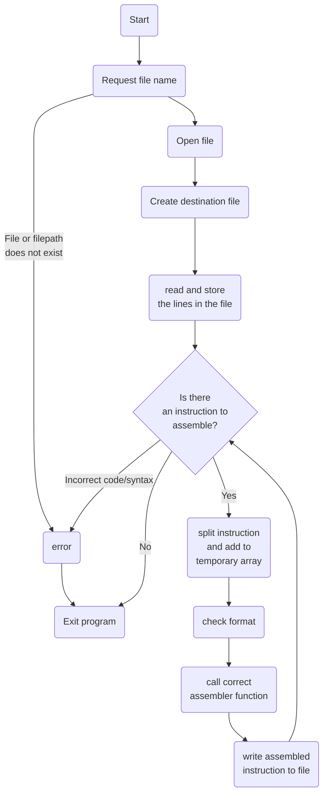

# 32-bit RISC-V ISA Assembler

A simple assembler

* Currently only supports R-type instructions
* Does not support labels
* Only supports uppercase instructions

## List of things to do

* Remove case sensititivty
* Add support for all instruction types
* Refactor, clean up and improve code
* Add a simple  UI


## Program Data Flow




## How to use

* Compile the program from the Source Code
* Create a .txt a file and fill it with instructions in the style as shown below

*remember that this program does not support labels yet, and you will have to calculate the offsets yourself at the time being*

* Run the program
* Assign file
* profit?

```MIPS
ADD x4, x6, x8
SW x4, 24, x28
ADDI x5, x5, 345
```

Get's turned into

```
00000000100000110000001000110011
00000000010011100010110000100011
00010101100100101000001010010011
```

After the program is done, you should have a file that is called *yourfilenamehere*_assembled.txt with your encoded instructions.