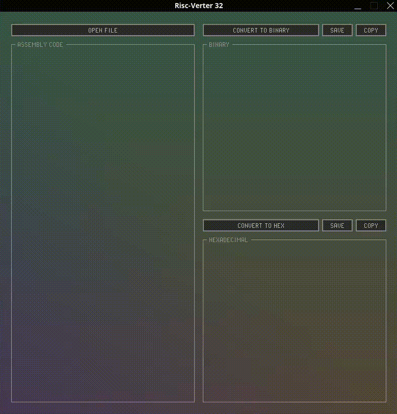

<p align="center">
    
</p>

<h1 align="center">Risc-Verter 32</h1>

<p align="center">
  A lightweight and minimalistic 32-bit RISC-V instruction converter for educational purposes
</p>

&nbsp; 

> **Features**
* Convert instructions to both binary and hexadecimal numbers
* Has support for all RV32I & RV32M Instructions
* Can convert up to 4096 instructions at once
* Can either copy or save the converted data
* The ability to place comments in your .txt files
* Offset calculation of labels
* Extremely lightweight, at less than 0.5mb it can be taken and use anywhere.

&nbsp; 

> **To-do**
* ~~Add a Gui~~
* ~~Add support for conversion to hexadecimal~~
* ~~Refactor, clean up and improve existing code~~
* ~~Remove case sensitivity~~
* ~~Add support for label offset calculation~~
* ~~Add support for RV32M instructions~~
* Add MS Windows support
* Add label address visualization
* Improve error handling
* Add support for register aliases 


## How to use

<p align="center">
  <br>
  
  <p align = "center">
    <font size ="2">
      <em> Gui created with <a href="https://github.com/raysan5/raygui/tree/master" target = "_blank" rel="nofollow"> Raygui </a>  and the 
      <a href="https://github.com/raysan5/raylib" target = "_blank" rel="nofollow"> Raylib </a> library 
      </em>
    </font>
  </p>
  <br>
</p>

### Instructions

Create a .txt a file and fill it with instructions in the style as shown below

```t
ADD x4, x6, x8            # Comments can be placed anywhere after a '#'
SW x4, 24, x28     
:label
blt x2, x3, 24

# or like this 
ADDI x5, x5, 345

BEQ x3, x4, label:
```

The converter will interprete the above .txt input as follows

```t
ADD x4, x6, x8
SW x4, 24, x28
blt x2, x3, 24               
ADDI x5, x5, 345
BEQ x3, x4, -8
```

Do note, labels can be up to 20 characters long and are case sensitive. 

Currently error handling is less than ideal but I intend to patch that soon. This means that you might encounter a segmentation fault when trying to convert something that can't be converted.

