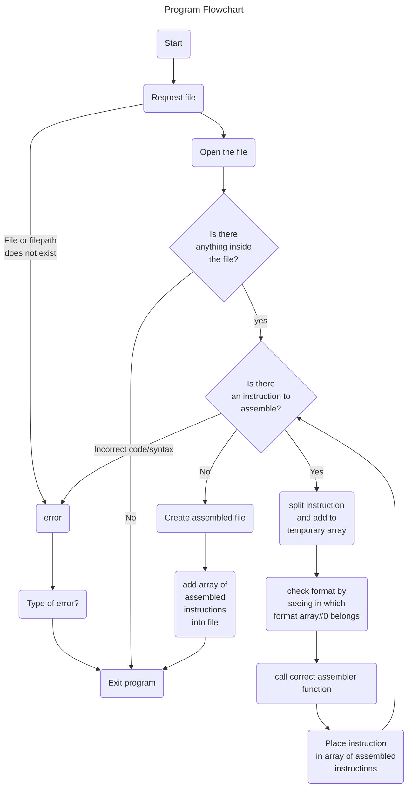

# 32-bit RISC-V ISA Assembler

A simple assembler to aid in initializing a  simulated RISC-V processor

```mermaid
---
title: Program Flowchart
---
graph TD

    start(Start)
    file(Request file)
    error(error)
    errorType(Type of error?)
    exit(Exit program)
    openFile(Open the file)
    analyzeFile{Is there 
    an instruction to 
    assemble?}
    split(split instruction
    and add to
    temporary array)
    format(check format by
    seeing in which
    format array#0 belongs)
    function(call correct assembler function)
    assembledFile(Place instruction
    in array of assembled
    instructions)
    createFile(Create assembled file)
    add(add array of 
    assembled
    instructions
    into file)
    data{Is there 
    anything inside 
    the file?}

    start --> file

    file -- File or filepath 
    does not exist --> error 

    file --> openFile
    error --> errorType
    errorType --> exit
    openFile --> data
    data -- No --> exit
    data -- yes --> analyzeFile
    analyzeFile -- Yes --> split
    analyzeFile -- No --> createFile
    createFile --> add
    add --> exit
    analyzeFile -- Incorrect code/syntax --> error
    split --> format
    format --> function
    function --> assembledFile
    assembledFile --> analyzeFile
```